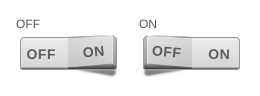
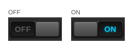
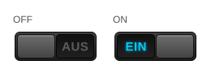
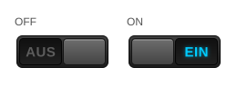
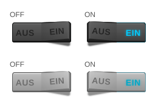
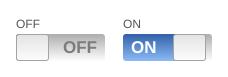
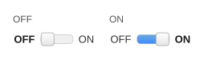

# fancyswitch für vis-2

Das Set fancyswitch enthält sieben Widgets, um einen Zustand ein- und auszuschalten: drei Schieber, zwei Wippen,
den Giva Labs iButton und einen kleinen Umschalter. Diese Seite beschreibt die Version für **vis-2**. vis
(vis-1) hat dieselben Widgets mit denselben Einstellungen; dort werden sie aus Bildern gezeichnet und werden
beim Vergrößern unscharf.

**Inhalt**

- [Allgemeines](#allgemeines)
    - [Voraussetzungen und Migration](#voraussetzungen-und-migration)
    - [Werte im Editor](#werte-im-editor)
    - [Gemeinsame Einstellungen der fünf Schalterstile](#gemeinsame-einstellungen-der-fünf-schalterstile)
- [Schalter hell - tplFancySwitch1](#schalter-hell---tplfancyswitch1)
- [Schieber dunkel - tplFancySwitch2](#schieber-dunkel---tplfancyswitch2)
- [Schieber dunkel EIN/AUS - tplFancyDarkAnAus](#schieber-dunkel-einaus---tplfancydarkanaus)
- [Schieber dunkel AUS/EIN - tplFancyDarkAnAusRev](#schieber-dunkel-ausein---tplfancydarkanausrev)
- [Wippe - tplFancyDarkAnAusWippe](#wippe---tplfancydarkanauswippe)
- [Giva Labs iButton - tplFancyGivaIButton](#giva-labs-ibutton---tplfancygivaibutton)
- [Umschalter - tplFancyToggleswitch](#umschalter---tplfancytoggleswitch)
- [Unterschiede zu vis-1](#unterschiede-zu-vis-1)

## Allgemeines

### Voraussetzungen und Migration

Die Widgets stehen im Editor von vis-2 im Widget-Set **fancyswitch**. Die hier beschriebenen React-Versionen
benötigen **vis-2 2.12.8** oder neuer. Ältere vis-2-Versionen zeigen stattdessen die vis-1-Widgets.

Mit vis-1 erstellte Projekte funktionieren unverändert weiter. Beide Versionen verwenden dieselben Widget-IDs
(`tplFancySwitch1`, `tplFancyGivaIButton`, …) und dieselben Attributnamen, und vis-2 wählt automatisch die
React-Version. Alle Einstellungen werden übernommen.

In den Tabellen unten ist **Einstellung** die Beschriftung im vis-2-Editor und **Attribut** der Name, unter dem
der Wert im Projekt gespeichert wird. Der Attributname ist das, was man braucht, wenn man ein Projekt als JSON
bearbeitet oder Einstellungen zwischen Widgets kopiert.

### Werte im Editor

_Wahr-Wert_ und _Falsch-Wert_ werden beim Klick in den Zustand geschrieben, und der aktuelle Wert des Zustands
wird mit ihnen verglichen. Der Editor speichert sie als Text, und das Widget wandelt diesen Text so um:

| Eingegebener Text | In den Zustand geschrieben |
| ----------------- | -------------------------- |
| _(leer)_          | `1` bzw. `0`               |
| `true`            | der Boolean `true`         |
| `false`           | der Boolean `false`        |
| `0`, `1`, `23.5`  | diese Zahl                 |
| `ON`, `zu`, …     | dieser Text                |

Ein Zustandswert gilt als **ein**, wenn

- er eine Zahl größer null ist oder ein Text, der sich als solche Zahl lesen lässt, oder
- sein Text exakt dem _Wahr-Wert_ entspricht - so funktionieren Zustände wie `ON` / `OFF`, oder
- er der Boolean `true` ist und der _Wahr-Wert_ "ein" bedeutet (`true`, `1` oder eine positive Zahl).

`null` und `undefined` werden wie der _Falsch-Wert_ behandelt.

### Gemeinsame Einstellungen der fünf Schalterstile

`tplFancySwitch1`, `tplFancySwitch2`, `tplFancyDarkAnAus`, `tplFancyDarkAnAusRev` und `tplFancyDarkAnAusWippe`
bieten alle dieselben Einstellungen.

| Einstellung         | Attribut                 | Beschreibung                                                                                                                                                           |
| ------------------- | ------------------------ | ---------------------------------------------------------------------------------------------------------------------------------------------------------------------- |
| Objekt-ID           | `oid`                    | Der Zustand, der angezeigt und geschrieben wird. Ohne ihn zeigt das Widget nur sein Aus-Bild und reagiert nicht auf Klicks.                                            |
| Falsch-Wert         | `valFalse`               | Wert, der beim Ausschalten geschrieben wird. Vorgabe `0`.                                                                                                              |
| Wahr-Wert           | `valTrue`                | Wert, der beim Einschalten geschrieben wird. Vorgabe `1`.                                                                                                              |
| Zustand invertieren | `invert`                 | Zeigt und schreibt das Gegenteil - praktisch für Zustände, bei denen `0` "ein" bedeutet.                                                                               |
| Auto AUS nach (ms)  | `autoOff`                | Nach dieser Zeit in Millisekunden wird wieder der entgegengesetzte Wert geschrieben. `0` schaltet die Funktion ab.                                                     |
| Nur lesen           | `readOnly`               | Das Widget zeigt den Zustand an, reagiert aber nicht auf Klicks.                                                                                                       |
| Text (links/rechts) | `text_false`/`text_true` | Die Beschriftung der beiden Hälften. `text_true` ist immer die Hälfte, die "ein" bedeutet - bei _Schieber dunkel EIN/AUS_ also die linke. Leer lassen für keinen Text. |

Ein Klick auf eine Hälfte schaltet in den Zustand, dessen Beschriftung diese Hälfte trägt: `EIN` schaltet ein,
`AUS` schaltet aus. Das Widget behält beim Vergrößern sein Seitenverhältnis, bleibt also scharf und sitzt
mittig in seinem Rahmen.

## Schalter hell - tplFancySwitch1

Die helle Wippe: eine Taste, die in der Mitte gelagert ist. Die Hälfte des aktuellen Zustands ist
heruntergedrückt, die andere steht zum Betrachter hin hoch und wirft einen Schatten; beim Umschalten kippt die
Taste um. Beide Beschriftungen bleiben sichtbar; hier leuchtet nichts.

Einstellungen: siehe [Gemeinsame Einstellungen der fünf Schalterstile](#gemeinsame-einstellungen-der-fünf-schalterstile).

## Schieber dunkel - tplFancySwitch2

Der dunkle Schieber auf einer dunklen Platte. Der Griff und beide Beschriftungen sitzen auf einem Streifen, der
wie bei einem echten Schiebeschalter hinter dem Rahmen gleitet: Die Beschriftung des aktuellen Zustands ist
sichtbar, die andere verschwindet unter dem Rahmen. Beim Umschalten gleitet der Streifen hinüber. `ON` leuchtet
cyan. Die Beschriftungen können beliebige kurze Texte sein, zum Beispiel `0` und `I`.

Einstellungen: siehe [Gemeinsame Einstellungen der fünf Schalterstile](#gemeinsame-einstellungen-der-fünf-schalterstile).

## Schieber dunkel EIN/AUS - tplFancyDarkAnAus

Derselbe Schieber ohne Platte, mit der Ein-Beschriftung auf der **linken** Hälfte (Vorgabe `EIN` / `AUS`).

Einstellungen: siehe [Gemeinsame Einstellungen der fünf Schalterstile](#gemeinsame-einstellungen-der-fünf-schalterstile).

## Schieber dunkel AUS/EIN - tplFancyDarkAnAusRev

Die gespiegelte Variante, mit der Ein-Beschriftung auf der **rechten** Hälfte.

Einstellungen: siehe [Gemeinsame Einstellungen der fünf Schalterstile](#gemeinsame-einstellungen-der-fünf-schalterstile).

## Wippe - tplFancyDarkAnAusWippe

Eine in der Mitte gelagerte Taste wie beim [hellen Schalter](#schalter-hell---tplfancyswitch1): Die Hälfte des
aktuellen Zustands ist heruntergedrückt, die andere steht hoch. Beim Umschalten kippt die Taste über ihre
Mittelstellung. Die Ein-Hälfte leuchtet cyan, solange sie gedrückt ist. Oben der dunkle Stil, unten der helle.

Zusätzlich zu den [gemeinsamen Einstellungen](#gemeinsame-einstellungen-der-fünf-schalterstile):

| Einstellung | Attribut     | Beschreibung                                   |
| ----------- | ------------ | ---------------------------------------------- |
| Heller Stil | `lightStyle` | Zeichnet die helle statt der dunklen Variante. |

## Giva Labs iButton - tplFancyGivaIButton

Ein Schiebeschalter mit blauer Ein-Fläche. Der Griff lässt sich anklicken oder ziehen.

| Einstellung             | Attribut             | Beschreibung                                                                                                                |
| ----------------------- | -------------------- | --------------------------------------------------------------------------------------------------------------------------- |
| Objekt-ID               | `oid`                | Der Zustand. Das Widget schreibt die Booleans `true` und `false`.                                                           |
| Nur lesen               | `readOnly`           | Das Widget zeigt den Zustand an, reagiert aber nicht.                                                                       |
| Testen                  | `test`               | Zeigt den Schalter im Editor in der Ein-Stellung, damit sich das Aussehen ohne Zustand prüfen lässt.                        |
| Text für EIN/AUS        | `labelOn`/`labelOff` | Die beiden Beschriftungen. Vorgabe `ON` und `OFF`.                                                                          |
| Hebelgröße anpassen     | `resizeHandle`       | `auto` richtet den Hebel nach den Beschriftungen, sobald diese von `ON`/`OFF` abweichen, `true` immer, `false` nie (33 px). |
| Containergröße anpassen | `resizeContainer`    | `auto` wie oben; `false` macht den Balken so breit wie das Widget - der einfachste Weg zu einer festen Breite.              |
| Ziehen erlaubt          | `enableDrag`         | Der Griff kann gezogen werden und nicht nur angeklickt.                                                                     |
| Animation               | `enableFx`           | Der Griff gleitet, statt zu springen.                                                                                       |
| Umschaltdauer (ms)      | `duration`           | Dauer dieser Animation. Vorgabe `200`.                                                                                      |

Der Balken ist 27 px hoch - die Höhe des Originals - und sitzt senkrecht mittig im Widget.

## Umschalter - tplFancyToggleswitch

Zwei Beschriftungen mit einem kleinen Schieber dazwischen. Ein Klick auf eine Beschriftung oder auf die Schiene
schaltet um.

| Einstellung          | Attribut                     | Beschreibung                                                             |
| -------------------- | ---------------------------- | ------------------------------------------------------------------------ |
| Objekt-ID            | `oid`                        | Der Zustand. Das Widget schreibt die Booleans `true` und `false`.        |
| Nur lesen            | `readOnly`                   | Das Widget zeigt den Zustand an, reagiert aber nicht.                    |
| Testen               | `test`                       | Zeigt den Schalter im Editor in der Ein-Stellung.                        |
| Text für FALSE/TRUE  | `text_false`/`text_true`     | Die beiden Beschriftungen. Vorgabe `OFF` und `ON`.                       |
| Schalter hervorheben | `highlight_switch`           | Füllt die Schiene bis zum Griff, solange der Schalter ein ist.           |
| Breite               | `width`                      | Breite der Schiene zwischen den Beschriftungen, in Pixeln. Vorgabe `40`. |
| HTML davor/danach    | `html_prepend`/`html_append` | Freies HTML links und rechts vom Schalter, wie in vis-1.                 |

Anders als in vis-1 benötigt dieses Widget kein jQuery-UI-Stylesheet mehr: es verwendet die Farben des
vis-2-Designs und funktioniert damit auch im dunklen Design.

## Unterschiede zu vis-1

- Die Widgets werden als SVG gezeichnet, statt aus einem PNG ausgeschnitten zu werden, und lassen sich daher
  frei vergrößern.
- Die Beschriftungen der fünf Schalterstile sind jetzt Einstellungen; in vis-1 waren sie Teil des Bildes.
- Die Schalter bewegen sich beim Umschalten: Die Schieber gleiten hinüber, ihre Beschriftungen mit dem Griff,
  und die Wippen kippen über ihre Mittelstellung. In vis-1 sprang das Bild.
- Ein Boolean-Zustand wird als "ein" erkannt, wenn der _Wahr-Wert_ auf der Vorgabe `1` steht. In vis-1 wurde ein
  `true` mit dem Text `1` verglichen und passte nie, sodass ein solches Widget dauerhaft aus blieb.
- Bei _Schieber dunkel EIN/AUS_ schalten beide Hälften in den Zustand, den ihre Beschriftung zeigt. In vis-1
  schrieb die linke Hälfte immer den _Falsch-Wert_, obwohl sie mit `EIN` beschriftet ist.
- Der farbige Teil des Umschalters wächst Richtung "ein". In vis-1 war die ganze Schiene gefüllt, solange der
  Schalter aus war, weil der jQuery-UI-Slider mit `range: "max"` konfiguriert war.
- Jedes Widget bietet _Nur lesen_.
- Die helle Wippe leuchtet in einem dunkleren Cyan, das auf der hellen Fläche lesbar ist.
